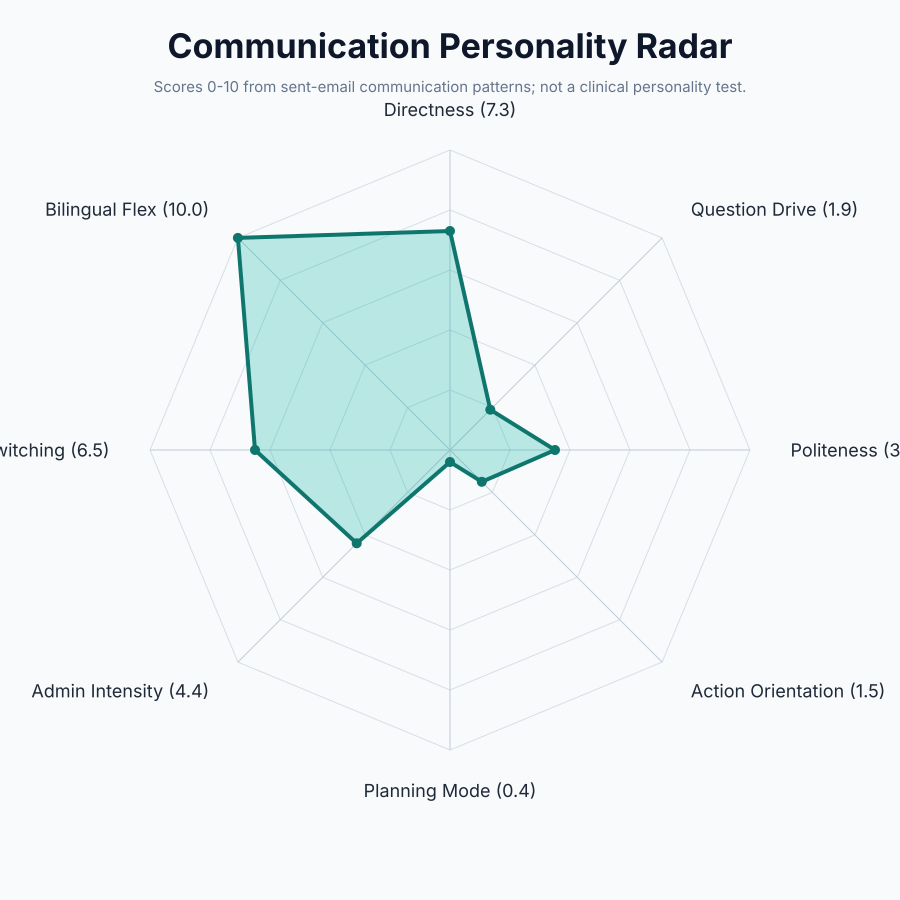
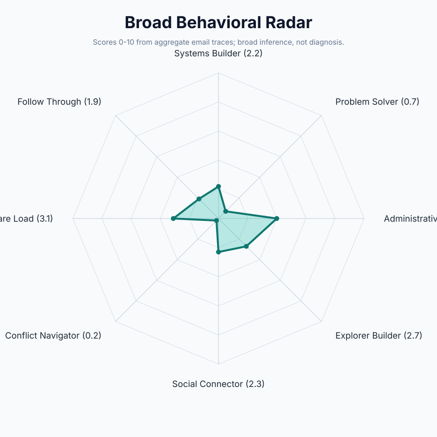

# From MBOX to Personality

[](https://github.com/ratonxi/from-mbox-to-personality)
[](#one-command-codex-install)
[](#quick-start)
[](LICENSE)

Local-first tool for turning a Gmail `.mbox` export into a reusable writing persona and a non-clinical behavioral communication profile.

The tool is designed for self-analysis or explicitly consented analysis. **Sent emails are the source of voice.** Received emails are only optional context and are never used to imitate the target person's tone.

## One-Command Codex Install

Install the Codex skill directly from GitHub with `npx`:

```powershell
npx github:ratonxi/from-mbox-to-personality install-skill
```

Then start a fresh Codex session and ask:

```text
Use from-mbox-to-personality to analyze my Gmail MBOX into a writing persona.
```

Useful options:

```powershell
npx github:ratonxi/from-mbox-to-personality install-skill --force
npx github:ratonxi/from-mbox-to-personality install-skill --codex-home "C:\Users\You\.codex"
```

You can also run the full local pipeline through `npx`:

```powershell
npx github:ratonxi/from-mbox-to-personality run -- --mbox "mail.mbox" --out "output" --target-email you@example.com
```

The full wrapper always emits persona, profile, and graph outputs, including `output/graphs/communication_radar.svg` and `output/graphs/broad_behavior_radar.svg`.

For best persona/radar quality and privacy, run the whole MBOX but index only sent mail:

```powershell
npx github:ratonxi/from-mbox-to-personality run -- --mbox "mail.mbox" --out "output" --target-email you@example.com --sent-only-index
```

## Quick Start

```powershell
python -m pip install -e .
from-mbox-to-personality scan --mbox "All mail Including Spam and Trash.mbox" --out output --target-email you@example.com
from-mbox-to-personality scan --mbox "All mail Including Spam and Trash.mbox" --out output --target-email you@example.com --sent-only-index
from-mbox-to-personality persona --input output/index.csv --out output/persona
from-mbox-to-personality profile --input output/index.csv --out output/profile
from-mbox-to-personality export-prompt --persona output/persona/persona.json --out output/persona/style_prompt_export.md
from-mbox-to-personality graphs --input output/index.csv --persona output/persona/persona.json --out output/graphs
```

If you omit `--target-email`, the scanner infers likely target sender addresses and uses the most frequent one.

The legacy `mbox-to-persona` CLI name is also kept as an alias.

## Outputs

- `index.csv`: message-level metadata, classification, redacted excerpt, scores, evidence ids.
- `index.jsonl`: same records as JSON Lines.
- `sent_corpus/sent_redacted.jsonl`: redacted snippets from target-authored mail.
- `received_context/received_redacted.jsonl`: redacted snippets from received mail.
- `persona/persona.json`: structured style profile.
- `persona/style_prompt.md`: pasteable AI prompt for writing in a similar style.
- `persona/me_style_prompt.md`: same prompt, named for the main use case.
- `persona/few_shot_examples.md`: short redacted examples.
- `persona/synthetic_examples.md`: invented examples shaped by the measured style.
- `persona/who_i_am_from_sent_email.md`: non-clinical self-presentation summary from sent mail.
- `persona/do_not_copy.md`: boundaries for safe use.
- `profile/psychological_profile.md`: non-clinical communication/behavior profile.
- `profile/evidence_table.csv`: evidence rows cited by the profile.
- `profile/limitations.md`: scope and safety limitations.
- `graphs/communication_radar.svg`: 0-10 radar chart of sent-email communication-personality signals.
- `graphs/communication_radar_scores.csv`: source scores for the communication radar.
- `graphs/broad_behavior_radar.svg`: 0-10 broad behavioral radar from aggregate email traces.
- `graphs/broad_behavior_radar_scores.csv`: source scores for the broad behavioral radar.

## Example Radars

An anonymized sample from a full sent-email local run:

Communication radar, based on sent-email voice signals:



Broad behavioral radar, based on sent emails plus received-email context as aggregate behavioral inference:



Scores are available in:

- `examples/public_graphs/sample_communication_radar_scores.csv`
- `examples/public_graphs/sample_broad_behavior_radar_scores.csv`

## Safety Boundary

This is not a diagnostic or clinical tool. It does not infer mental health conditions. It produces behavioral observations from communication patterns with confidence levels and evidence references. Use it to replicate consented writing tone, not to impersonate someone deceptively.
